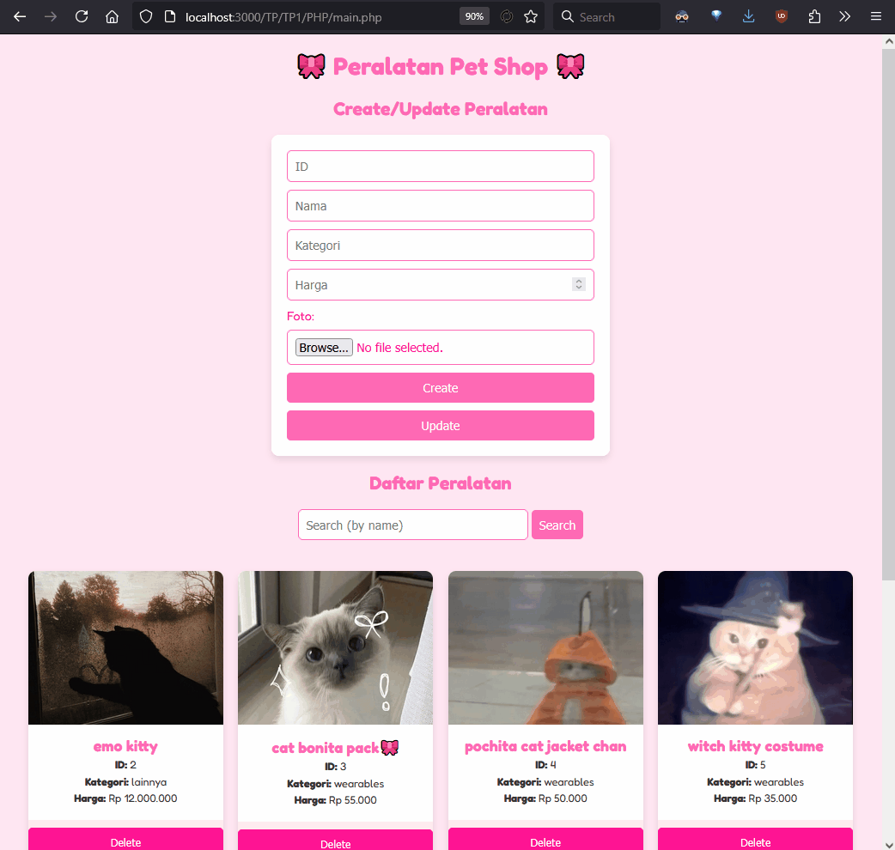
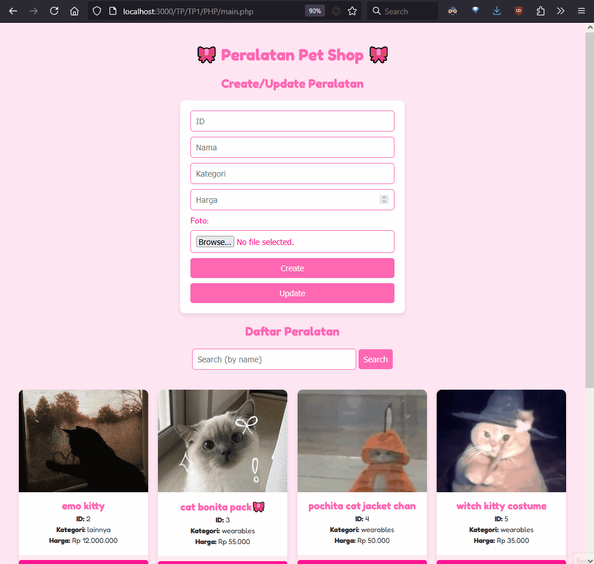
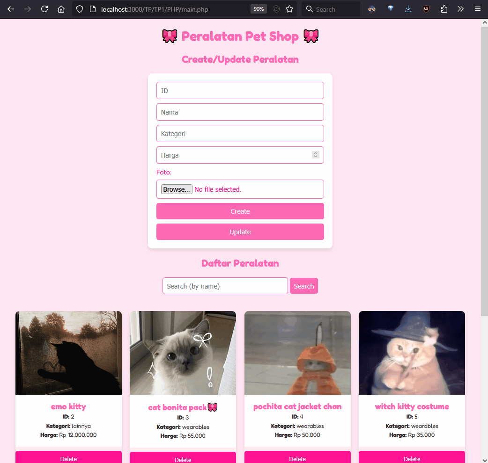
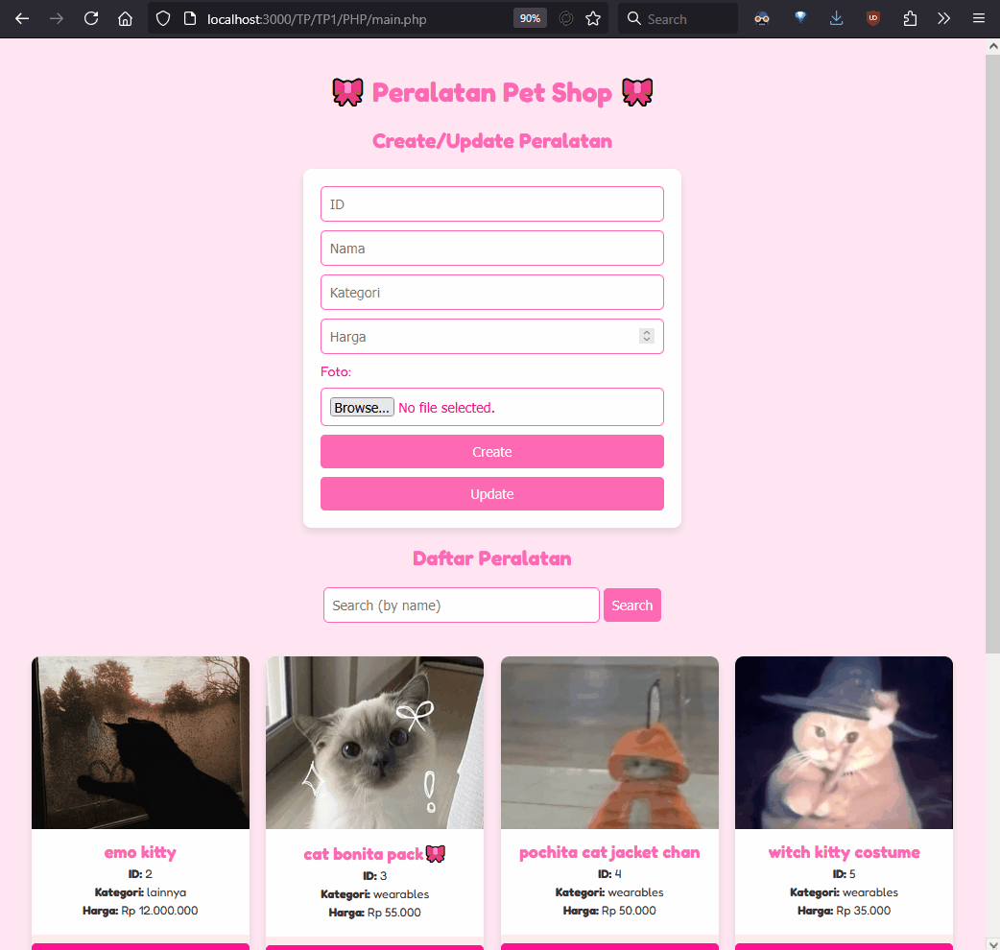

# Janji
Saya Zakiyah Hasanah dengan NIM 2305274 mengerjakan Latihan Tugas Praktikum 1 dalam mata kuliah Desain dan Pemrograman Berorientasi Objek untuk keberkahanNya maka saya tidak melakukan kecurangan seperti yang telah dispesifikasikan. Aamiin.

# Deskripsi Program PHP
Pada program ini, user dapat melakukan operasi CRUD dan search terhadap list peralatan Pet Shop. 

Adapun struktur classnya seperti berikut.

> class `PeralatanPetShop`
> - `id` (string)
> - `nama` (string)
> - `kategori` (string)
> - `harga` (int)
> - `foto` (string)

# Dokumentasi

## create
create gagal: (id sudah ada)

create sukses:

## update
update gagal: (id tidak ditemukan)

update sukses:

## delete 

## search
