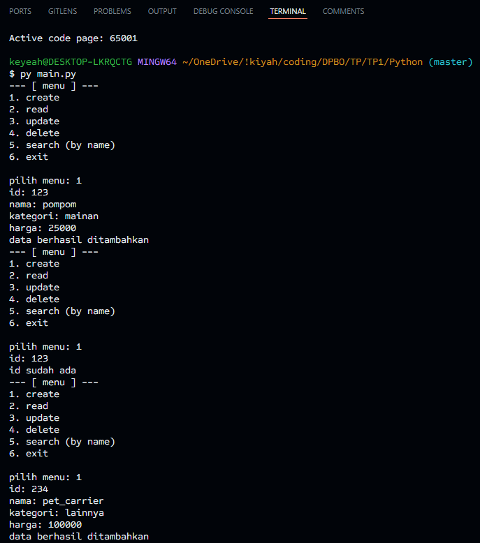
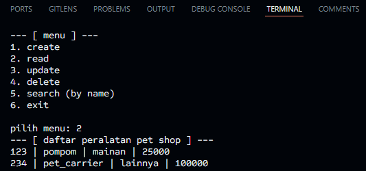
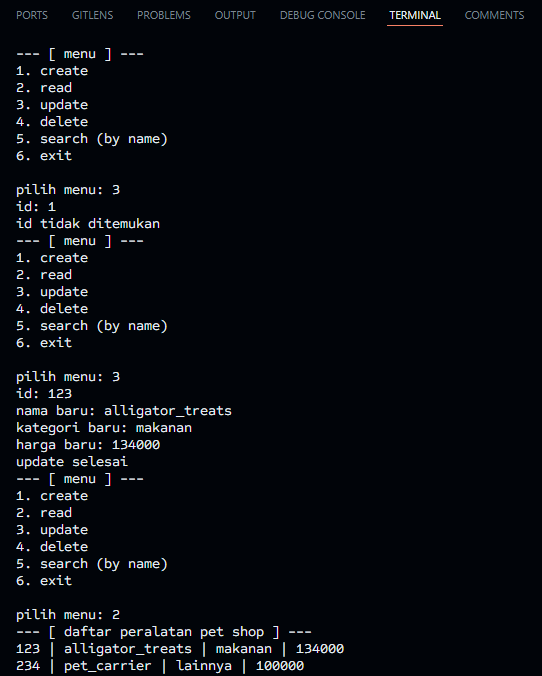
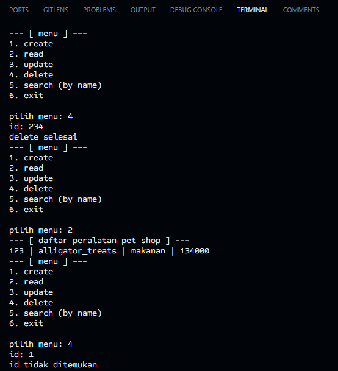
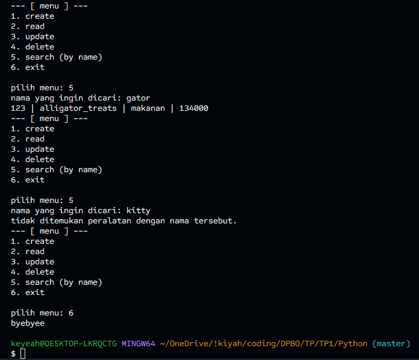

# Janji
Saya Zakiyah Hasanah dengan NIM 2305274 mengerjakan Latihan Tugas Praktikum 1 dalam mata kuliah Desain dan Pemrograman Berorientasi Objek untuk keberkahanNya maka saya tidak melakukan kecurangan seperti yang telah dispesifikasikan. Aamiin.

# Deskripsi Program Python
Pada program ini, user dapat melakukan operasi CRUD terhadap list peralatan Pet Shop. User dapat memilih menu sesuai angkanya. Pilihan menu yang disajikan ke user ada 5 yaitu:
1. create
2. read
3. update
4. delete
5. search (by name)
6. exit

Adapun struktur classnya seperti berikut.

> class `PeralatanPetShop`
> - `id` (string)
> - `nama` (string)
> - `kategori` (string)
> - `harga` (int)

# Dokumentasi
## create

## read

## update

## delete 

## search + exit
